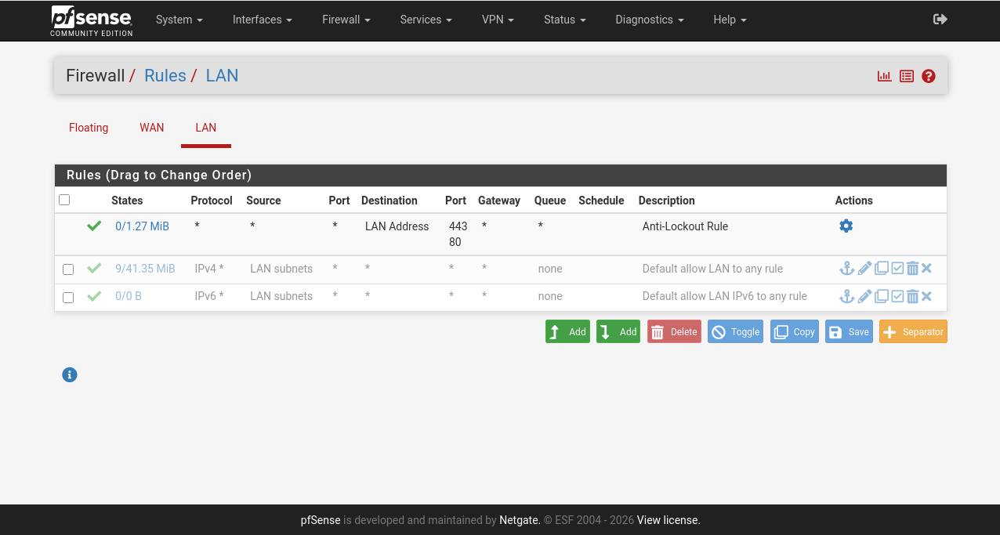
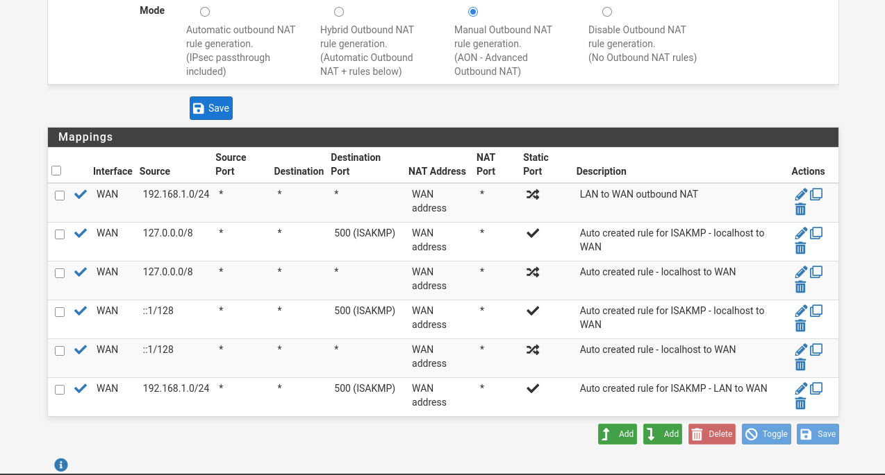
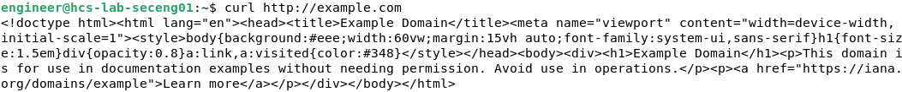
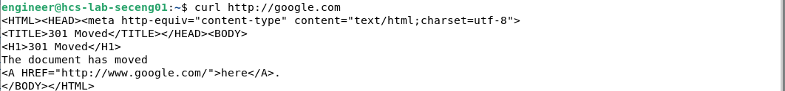

# Implementing Least-Privilege Egress Filtering with Manual NAT in pfSense
Implementation of least-privilege outbound egress filtering in pfSense using explicit firewall rules and Manual NAT, validated through structured troubleshooting and protocol-level testing.

**Lab Type:** Network Security / Firewall Policy Engineering  
**Platform:** pfSense + Ubuntu Client VM  
**Focus Areas:** Egress Filtering, Manual NAT, Layered Troubleshooting, Least Privilege  
**Skill Level:** Security Engineering Foundations  

---

## 1. Objective

**pfSense** is a powerful open source firewall and router platform. The objective is to implement a **least-privilege outbound security policy** that allows LAN clients to access only:

- HTTP (TCP 80)
- HTTPS (TCP 443)
- DNS (UDP 53)

All other outbound traffic must be blocked.

Additionally:

- Replace Automatic Outbound NAT
- Implement explicit Manual Outbound NAT
- Validate behavior through controlled testing

---

## 2️. Baseline Risk

By default, pfSense includes:

- `LAN → Any (IPv4 allow rule)`
- Automatic Outbound NAT

This configuration:

- Allows unrestricted outbound access
- Expands exfiltration surface
- Permits gaming, file sharing, shadow IT
- Masks protocol awareness

From a security engineering standpoint, this violates **least privilege**.

---

## 3️. Troubleshooting Phase — Internet Failure

After modifying firewall rules, the Ubuntu client VM lost internet connectivity.

### Diagnostic Methodology

Instead of modifying firewall policy blindly, I validated connectivity layer by layer.

| Test | Result | Conclusion |
|------|--------|------------|
| `ping 192.168.1.1` | Success | LAN connectivity confirmed |
| `ping 8.8.8.8` | Success | NAT functioning |
| `ping google.com` | Failed | DNS issue isolated |

> **Key Insight:**  
> DNS failure can appear identical to total internet outage.  
> Always validate Layer 3 connectivity before assuming firewall misconfiguration.

This confirmed:

- Firewall and NAT were operational
- The issue was DNS resolution on the client

This troubleshooting sequence demonstrates structured network analysis rather than reactive reconfiguration.

---

## 4️. Phase One — Explicit Security Policy Mode

### Step 1: Disable IPv6 Rule

If left enabled, IPv6 can bypass IPv4 restrictions entirely.

### Step 2: Disable Default “LAN to Any” Rule (IPv4)

At this point:

- All outbound internet access was lost
- Firewall entered implicit deny state

This is expected behavior in a least-privilege model.

<!-- IMAGE: LAN Firewall Rules showing disabled default allow rule -->

<p align="center">
  <br>
  <em>Figure 1 — Default LAN allow rules disabled, enforcing implicit deny.</em>
</p>

---

## 5. Phase Two — Controlled Access Restoration

Explicit rules were created for:

- TCP 80 (HTTP)
- TCP 443 (HTTPS)
- UDP 53 (DNS)

Internet access was restored selectively.

<!-- IMAGE: LAN Firewall Rules showing HTTP/HTTPS/DNS rules -->

---

## 6️. Outbound NAT Modes in pfSense

pfSense provides four outbound NAT modes:

| Mode | Description | Typical Use |
|------|-----------|------------|
| Automatic | Auto-generated NAT rules | Home / Small office |
| Hybrid | Automatic + manual additions | Transitional environments |
| Manual | Full administrator control | Enterprise / High security |
| Disable | No NAT processing | Routed public IP environments |

---

## 7️. Manual Outbound NAT Implementation

### Goal

When traffic from `192.168.1.0/24` exits WAN:

Rewrite source IP to firewall’s WAN address.

### Configuration Steps

- Switched from **Automatic** to **Manual Outbound NAT**
- Replaced auto-generated rules
- Created explicit rule:

  - Source: `192.168.1.0/24`
  - Interface: WAN
  - Translation Address: WAN Address

<!-- IMAGE: Outbound NAT table with Manual mode selected -->


This ensures:

- Explicit translation control
- No hidden automation
- Full visibility into NAT mechanics

---

## 8️. Validation Testing

Testing was performed from Ubuntu client.

### HTTP/HTTPS Test

```bash
curl http://example.com
curl https://google.com
```

Result: Success

<!-- IMAGE: Ubuntu terminal showing successful curl output -->



---

### ICMP Test

```bash
ping 8.8.8.8
```

Result: Blocked

As expected:

- No allow rule for ICMP
- Implicit deny applied
- No state created

---

## 9️. Traffic Validation Matrix

| Traffic Type | Result  | Reason |
|--------------|---------|--------|
| TCP 80       | Allowed | Explicit firewall rule |
| TCP 443      | Allowed | Explicit firewall rule |
| UDP 53       | Allowed | DNS rule |
| ICMP         | Blocked | No allow rule |

---

## 🔬 What Happened Technically

### When Accessing `google.com`

1. DNS query allowed (UDP 53)
2. TCP 443 session allowed by firewall rule
3. Source IP translated via Manual NAT
4. Response returned
5. State table tracked session

---

### When Pinging `8.8.8.8`

1. ICMP request hit LAN interface
2. No matching allow rule
3. Implicit deny triggered
4. Packet dropped
5. No state created

---

## Security Engineering Takeaways

### 1. Implicit Deny is the True Default
Security posture improves when access must be explicitly granted.

### 2. DNS Is a Hidden Dependency
Blocking DNS can mimic total outage. Always isolate layers before modifying rules.

### 3. Manual NAT Increases Visibility
Automatic NAT works — but obscures translation mechanics.  
Manual mode forces architectural awareness.

### 4. Least Privilege Reduces Exfiltration Risk
Outbound filtering limits:

- Malware callbacks
- Unauthorized uploads
- Shadow IT services
- Peer-to-peer applications

---

## 📌 Why This Lab Matters

Many entry-level labs tend to focus on blocking inbound attacks, configuring intrusion detection systems, or implementing VLAN segmentation. While those controls are important, they often overlook a critical aspect of enterprise security: controlling what leaves the network. This lab shifts the focus to outbound traffic governance, emphasizing egress filtering as a core defensive strategy. That mindset directly aligns with Data Loss Prevention (DLP) initiatives, insider threat mitigation efforts, enterprise SOC egress monitoring practices, and foundational Zero Trust principles, where trust is never assumed—even for internal systems communicating outward.

---

## 🔥 Final Outcome

The default “allow any” LAN rule was removed and replaced with explicit outbound rules permitting only HTTP, HTTPS, and DNS traffic, while ICMP was intentionally blocked to reinforce strict egress control. Automatic NAT was disabled and replaced with Manual NAT to ensure precise translation behavior aligned with the defined security policy. Connectivity was validated through controlled testing, and DNS-related issues were investigated and documented using a structured troubleshooting methodology. Together, these steps demonstrate disciplined troubleshooting, deliberate firewall policy engineering, a clear understanding of NAT mechanics, protocol-level awareness, and the practical implementation of least-privilege design principles.
